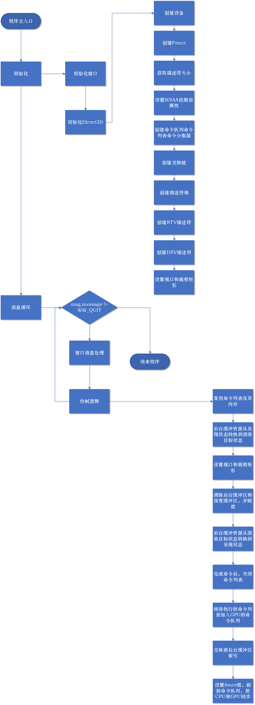
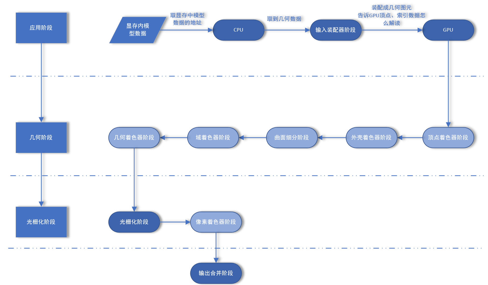

# DirectX12 3D Learn

*学习参考书籍《DirectX12 3D 游戏开发实战》*

[DirectX3D 12 编程指南](https://docs.microsoft.com/zh-cn/windows/win32/direct3d12/directx-12-programming-guide)

[官网API文档](https://docs.microsoft.com/en-us/windows/win32/api/)

[官方代码示例库](https://github.com/d3dcoder/d3d12book)

## 数学知识

### 向量代数

#### 向量Vector

表示大小和方向的量，同一个向量在不同坐标系中有着不同的对应坐标表示

Direct3D采用左手坐标系

向量加法：同维向量之间才可以进行加法运算

标量乘法(scalar multiplication)：向量与标量相乘

向量减法：可以通过向量加法和标量乘法表示v1 - v2 = v1  + （-1 * v2） = v1 + （-v2）

#### 长度和单位向量

向量的长度（模）：向量的大小

单位化向量（normalizing）：把一个向量的长度变为单位长度

#### 点积（dot product）

计算结果为标量的向量乘法运算

v1 * v2 = 0    两向量正交 v1 ⊥ v2

v1 * v2 > 0    两向量之间夹角小于90°

v1 * v2 < 0    两向量之间夹角大于90°

正交投影 

规范正交

#### 叉积（cross product）

计算结果为向量的向量乘法运算

只有3D向量的叉积有定义，不存在2D叉积

v1 × v2 = v3    v3与v1、v2彼此正交

叉积的反交换定律

v1 × v2 ≠ v2 × v1

v1 × v2 = -v2 × v1

2D向量伪叉积：

v1 × v2 = (v1.x, v1.y) * (-v1.y, v1.x) = 0     v1 ⊥ v2 ，v1 ⊥ -v2

#### 点

位置向量：点仅表示位置，向量表示着大小方向

#### DirectXMath API 向量运算

- Direct3D应用程序的3D数学库，借助128位宽的单指令多数据寄存器（SIMD），利用一条SIMD指令即可同时对4个32位浮点数或整数进行运算。比普通向量运算效率高

- 使用directXMath要导入的头文件

  `#include <DirectXPackedVector.h>`

  所有代码都以内联的方式实现在头文件里，DirectXMath.h 文件中的代码都存在于DirectX命名空间中，DirectXPackedVector.h文件中的代码都位于`DirectX::PackedVector`命名空间内

- x86平台需要启用SSE2指令集，x64则不需要

- 核心向量类型：XMVECTOR

  它会被映射到SIMD硬件寄存器，通过SIMD指令配合进行向量运算处理

  `typedef __m128 XMVECTOR;`

  __m128是一种特殊的SIMD类型，在计算向量的过程中，必须通过此类型才可充分利用SIMD技术，在计算过程中用不到的向量分量则将置零并忽略

- XMVECTOR类型数据需要按16字节对齐，这对局部变量全局变量都是自动实现的，而类中的数据成员需要使用XMFLOAT2、XMFLOAT3、XMFLOAT4来代替，但如果将这些类型直接用于计算则无法充分发挥SIMD的高效特性，所以要将这些类型的实例转为XMVECTOR类型

  XMFLOAT*n* 转 XMVECTOR：

  `XMVECTOR XM_CALLCONV XMLoadFloat2(const XMFLOAT2* pSource);`

  XMVECTOR 转 XMFLOAT*n*：

  `void XM_CALLCONV XMStoreFloat2(XMFLOAT2* pDestination, FXMVECTOR V);`

  XMVECTOR中取分量：

  `float XM_CALLCONV XMVectorGetX(FXMVECTOR V);`

  分量 转 XMVECTOR：

  `XMVECTOR XM_CALLCONV XMVectorSetX(FXMVECTOR V, float x);`

  为了代码更具通用性，不受具体平台编译器的影响

  - XM_CALLCONV 调用约定注解：会根据编译器版本确定对应的调用约定属性， 一点要把XM_CALLCONV加到函数名之前

  - 为了提高效率可以将XMVECTOR类型的值作为函数的参数直接传到SSE寄存器里，而不是栈里，此方式传递的参数数量取决于用户使用的平台和编译器，所以要用FXMVECTOR、GXMVECTOR、HXMVECTOR、CXMVECTOR

    - 传递规则：

      前3个 FXMVECTOR

      第4个 GXMVECTOR

      第5、6个 HXMVECTOR

      其余的 CXMVECTOR

- 常用API

  - 向量模长

    `XMVECTOR XM_CALLCONV XMVector3Length();`

  - 向量模的平方

    `XMVECTOR XM_CALLCONV XMVector3LengthSq();`

  - 两个向量的点积

    `XMVECTOR XM_CALLCONV XMVector3Dot();`

  - 两个向量的叉积

    `XMVECTOR XM_CALLCONV XMVector3Cross();`

  - 单位向量

    `XMVECTOR XM_CALLCONV XMVector3Normalize();`
    
  - 使用一个参考法线向量，将一个三维向量分成平行和垂直与法线的分量
  
    `XM_CALLCONV XMVector3ComponentsFromNormal(XMVECTOR* pParallel,  XMVECTOR* pPerpendicular,FXMVECTOR V,FXMVECTOR Normal);`
  
  - 返回两个向量之间的弧度
  
    `XMVECTOR XMVector3AngleBetweenVectors(FXMVECTOR v1, FXMVECTOR v2);`
  
  - 测试两个向量是否相等
  
    `XM_CALLCONV XMVector3Equal(FXMVECTOR V1, FXMVECTOR V2 );`
  
  - 测试两个向量是否不相等
  
    `XM_CALLCONV XMVector3NotEqual(FXMVECTOR V1, FXMVECTOR V2);`
  
  - 弧度转角度
  
    `XM_CONSTEXPR float XMConvertToDegrees(float fRadians);`

### 矩阵代数

#### 矩阵Matrix

- 用于描述几何体的变换，例如缩放、旋转、平移

- 借助矩阵可以将点或向量的坐标在不同的坐标系之间进行转换

- 行数和列数的乘积表示矩阵的维度

- 矩阵相等、加法运算、标量乘法、减法运算

  - 两个矩阵相等，行数列数必须相同

  - 只有行数列数相同的两个矩阵相加才有意义

  - 标量乘法将一个标量依次与矩阵内的每个元素相乘

  - 利用矩阵的加法和标量乘法可以定义矩阵减法

    A - B = A + (-1 * B) = A + (-B)

#### 矩阵乘法

- 横*竖

- A * B   A的横向元素数与B的竖向元素数相等才有意义

- 向量与矩阵的乘法是一种线性组合

#### 转置矩阵

- 原矩阵的行与列进行交换所得到的新矩阵
- A + B的转置矩阵 = A的转置矩阵 + B的转置矩阵
- n * A的转置矩阵 = n * A的转置矩阵
- A * B的转置矩阵 = B的转置矩阵 * A的转置矩阵
- A的转置矩阵的转置矩阵 = A

#### 单位矩阵

- 主对角线元素均为1，其它元素都为0的方阵
- 单位矩阵是矩阵的乘法单位元
- A * 单位矩阵 = A

#### 矩阵行列式

- 余子阵 一个n * n的矩阵去掉矩阵的第i行 第j列
- 用来手推逆矩阵的

#### 逆矩阵

- 矩阵不存在除法概念，但定义了矩阵乘法的逆运算
- 只有方阵才具有逆矩阵，但不是每个方阵都有逆矩阵
- 存在逆矩阵的方阵为可逆矩阵，不存在逆矩阵的方阵为奇异矩阵
- 可逆矩阵的逆矩阵是唯一的
- 矩阵 * 矩阵的逆矩阵 = 矩阵的单位矩阵
- B的逆矩阵 * A的逆矩阵 = A * B 的逆矩阵

#### DirectXMath API 矩阵相关

- 矩阵类型 XMMATRIX

- XMMATRIX底层由4个XMVECTOR实例构成，并借此来使用SIMD技术

- 建议用XMFLOAT4X4来存储来存储类中的矩阵类型数据成员

- XMMATRIX 与 XMFLOAT4X4内存排列一致，对齐不一致，是可以进行内存拷贝的

- 常用API

  - 返回单位矩阵

    `XMMATRIX XM_CALLCONV XMMatrixIdentity();`

  - 返回是否为单位矩阵

    `bool XM_CALLCONV XMMatrixIsIdentity(FXMMATRIX M);`

  - 返回矩阵的转置矩阵

    `XMMATRIX XM_CALLCONV XMMatrixTranspose(FXMMATRIX M);`

  - 返回矩阵的行列式

    `XMVECTOR XM_CALLCONV XMMatrixDeterminant(FXMMATRIX M);`

  - 输入矩阵的行列式以及矩阵本身，返回矩阵的逆矩阵

    `XMMATRIX XM_CALLCONV XMMatrixInverse(XMVECTOR* pDeterminant, FXMMATRIX  M)`

- 参数传递规则与XMVECTOR一致

### 变换

#### 线性变换

- 缩放矩阵

  ```
  x,0,0,0
  0,y,0,0
  0,0,z,0
  0,0,0,1
  ```

- 旋转矩阵

  ```c++
  // 绕x轴旋转
  1,0,0,0
  0,c,s,0
  0,-s,c,0
  0,0,0,1
  
  // 绕y轴旋转
  c,0,-s,0
  0,1,0,0
  s,0,c,0
  0,0,0,1
  
  // 绕z轴旋转
  c,s,0,0
  -s,c,0,0
  0,0,1,0
  0,0,0,1
  ```

- 正交矩阵

  矩阵的行向量都是规范正交，则该矩阵为正交矩阵，正交矩阵的逆矩阵与转置矩阵是相等的，所有的旋转矩阵都是正交矩阵

#### 仿射变换

- 由线性变换与平移变换组合而成

- 向量的性质中没有位置这个概念

- (x,y,z,0)表示向量    (x,y,z,1)表示点

- 两点之差得的是一个向量，点与向量之和得到的是一个点

- 平移矩阵

  ```
  1,0,0,0
  0,1,0,0
  0,0,1,0
  x,y,z,1
  ```

#### 变换的复合

矩阵之间的乘法运算不满足交换律，多种变换注意连乘顺序，顺序不同得到的结果是不同的

#### 坐标系变换

- 不同坐标系之间的坐标转换，在坐标系变换过程中几何体本身不会发生改变，改变的仅仅是参考坐标系
- 通过逆矩阵可进行世界坐标与本地坐标的相互转换

#### DirectXMath API  变换相关

- 常用API

  - 构建一个缩放矩阵

    `XMMATRIX XM_CALLCONV XMMatrixScaling(float ScaleX, float ScaleY, float ScaleZ);`

  - 用一个3D向量来构建缩放矩阵

    `XMMATRIX XM_CALLCONV XMMatrixScalingFromVector(FXMVECTOR Scale);`

  - 构建一个绕X轴旋转多少弧度的矩阵(YZ轴类似)

    `XMMATRIX XM_CALLCONV XMMatrixRotationX(float Angle);`

  - 构建平移矩阵

    `XMMATRIX XM_CALLCONV XMMatrixTranslation(float OffsetX, float OffsetY, float OffsetZ);`

- 可以直接用封装好的库

### 三角函数

##  Direct3D 基础

### Direct3D的初始化

#### 预备知识

- Direct3D 12 基本概念

  底层图形应用程序编程接口，可在应用程序中对图形处理器进行控制和编程，借此以硬件加速的方式渲染虚拟的3D场景

- 组件对象模型(COM)

  - 使DirectX不受编程语言束缚，并且使之向后兼容的技术

  - 通常将COM对象视为一种接口，可以把它当作一个C++类来使用

  - 要获取指向某COM接口的指针，需要借助特定函数或另一COM接口的方法，而不是用C++的new去创建一个COM接口

  - COM采用引用计数方式管理内存，在使用完某个接口后，要调用Release方法，而不是delete来删除，当COM对象的引用计数为0时，会自动释放自己所占用的内存

  - COM接口的所有功能都是从`IUnknown`这个COM接口继承而来，包括`Release`方法

  - 为了方便用户管理COM对象的生命周期，Windows运行时库提供了`#include <wrl.h>`  `ComPtr`类，可以当作COM对象的智能指针，超出作用域会自动调用Release

  - 常用API

    `Get`：返回指向该底层COM接口的指针

    `GetAddressOf`：返回执行该底层COM接口的指针的地址，也就是&(COM接口指针)

    `Reset`：将该ComPtr实例设置为nullptr，释放相关的所有引用(同时减少其底层COM的引用计数)，和ComPtr目标实例赋值为nullptr的效果相同

- 纹理格式(texture)

  - 2Dtexture由数据元素构成的矩阵，可以看作2D数组，用来存储2D图像数据，纹理中每个元素存储的都是一个像素(*pixel 构成图像的基本元素，图像的采样单位，在Direct3D中，像素被抽象为具有一定长宽的色块*)的颜色，但纹理并不只是用来存储颜色信息的。例如，法线贴图(normal mapping) 纹理内的每个元素存储的是一个3D向量而不是颜色信息
  - 简单理解，纹理相当于特定数据元素所构成的数组，但不只是数据数组这么简单，可能还具有多种mipmap层级，GPU会据此对它们进行特殊处理，例如，运用过滤器(filter)和进行多重采样(multisample)
  - 并不是任意类型的数据元素都能用于组成纹理，只能存储`DXGI_FORMAT`枚举类型中描述的特定格式的数据元素
  - 无类型(typeless)格式纹理仅用来预留内存，在纹理被绑定到渲染流水线后，再具体给他相应的数据类型，类似C++的强转
  - `DXGI_FORMAT`枚举类型 也可用于描述顶点以及索引的数据格式

- 交换链和页面翻转（屏幕二次缓冲/双缓冲/double buffering）

  - 避免动画出现画面闪烁，将动画帧完整绘制在后台缓冲区的离屏(off-screen)纹理内，将指定动画帧的整个场景绘制到后台缓冲区，就会以一个完整的帧画面显示在屏幕上，便不会看出帧绘制的过程

  - 为此需要利用硬件管理的两种纹理缓冲区：

    - 前台缓冲区(front buffer)

      存储当前显示在屏幕上的图像数据  

    - 后台缓冲区(back buffer)

      动画的下一帧被毁旨在后台缓冲区

  - 呈现(present)

    前后台缓冲互换属于高效操作，只需要交换前后台缓冲区指针即可

    当后台缓冲区的动画帧绘制完成后，后台缓冲区变为前台缓冲区显示新一帧的画面，之前的前台缓冲区转为后台缓冲区为下一帧的展示填充数据

  - 交换链(swap chain)

    前台缓冲区和后台缓冲区构成了交换链，在Direct3D中用`IDXGISwapChain`接口来表示，该接口提供了存储前后台缓冲区的两种纹理，修改缓冲区大小，呈现缓冲区内容等方法，用的时候查API文档

- 深度缓冲(depth buffer)

  - 为了确定不同物体间的像素前后顺序，Direct3D采用深度缓冲(depth buffering)或z缓冲(z-buffering，z指坐标)技术
  - 若使用了深度缓冲，则不需要在乎物体的绘制顺序

  - 深度缓冲区也是一种纹理，这种纹理资源存储的是特定像素的深度信息，并非图像数据，深度值范围为0.0-1.0，0.0代表观察者在视锥体中能离自己最近的物体，1.0代表观察者在视锥体中能看到离自己最远的物体
  - 深度缓冲区元素与后台缓冲区的像素呈对应关系
  - 深度缓冲原理
    - 计算每个像素的深度值，并执行深度测试
  - 深度缓冲工作步骤
    - 后台缓冲区清理为默认颜色(0,0,0)，深度缓冲区清理为默认值(通常为1.0)
    - 物体深度测试，深度小于默认深度，更新缓冲区以及默认深度，深度大于默认深度，不更新
  - 需要用明确的数据格式来创建深度缓冲
    - `DXGI_FORMAT_D32_FLOAT_S8X24_UINT`
    - `DXGI_FORMAT_D32_FLOAT`
    - `DXGI_FORMAT_D24_UNORM_S8_UINT`
    - `DXGI_FORMAT_D16_UNORM`
  - *模板缓冲区待学习*

- 资源与描述符(descriptor)

  - 在Direct3D中，资源不能直接与渲染流水线相绑定，在绘制调用时对其引用的资源去指定描述符
  - 每个描述符都有一种具体类型，指明资源的具体作用
    - CBV 常量缓冲区视图 / SRV 着色器资源视图 / UAV  无序访问视图
    - sampler 采样器 表示采样器资源（用于纹理贴图）
    - RTV 渲染目标视图资源
    - DSV 深度/模板试图资源
  - 可以把描述符对象看作GPU识别以及描述资源的一种轻量级结构体
  - 同一种资源可以创建不同的描述符，借此可以将同一种资源绑定到渲染流水线的不同阶段
  - 应用程序可以通过创建描述符堆(descriptor heap)来分配描述符的内存

- 采样

  - 超级采样(SSAA)

    图像颜色根据每一个子像素来计算

  - 多重采样(MSAA)

    求取图像颜色时每个像素只计算一次，对子像素求取平均值

  - 时间采样(TemporalAA)

    [大佬专栏](https://zhuanlan.zhihu.com/p/46841906)

  最终目的是将三角形边缘的混合，也就是实现了抗锯齿的功能，目前基本使用时间采样较多

- DirectX图形基础结构(DXGI)

  配合Direct3D使用的API，使多种图形的API中所共有的底层任务能借助一组通用API来进行处理

  引用头文件 ： `#include <dxgi1_4.h>`

- 功能支持的检测

  `ID3D12Device`是Direct3D中最重要的接口，可以看作是图形硬件设备的软件控制器，通过它来创建GPU资源以及其他用于控制图形硬件的特定接口

  通过`ID3D12Device::CheckFeatureSupport();`进行各种功能的检测

  原型：

  ```c++
  HRESULT STDMETHODCALLTYPE CheckFeatureSupport( 
              D3D12_FEATURE Feature,
              void *pFeatureSupportData,
              UINT FeatureSupportDataSize)
  ```

- 资源驻留

  - GPU memory 显存。GPU控制的显存相当于CPU控制的内存(系统内存 system memory)。CPU内部有多级缓存与寄存器，分别用于缓存指令、控制CPU，GPU内部也有缓存与寄存器，分别用于缓存纹理、缓存着色器指令等、控制GPU
  - 由于显存空间有限，为了使应用程序占用最小的显存空间，Direct3D 12中，应用程序可控制资源在显存中的去留，主动管理资源的驻留情况(residency)
  - 无论资源是否已经在显存中，都可进行管理
  - Direct3D 11中由系统自动管理

  - 程序应当避免在短时间内于显存中交换进出相同的资源，会引起过高开销
  - 理想状态：清出的资源在短时间内不会再次使用

#### CPU与GPU之间的交互

- 命令队列和命令列表

  每个GPU至少维护一个命令队列(command queue), 通过Direct3D API CPU可以利用命令列表(command list)将命令提交到这个队列去

  Direct3D12中 `ID3D12CommandQueue` 接口表示命令队列，`CreateCommandQueue`创建队列

  `Microsoft::WRL::ComPtr <ID3D12CommandQueue> mCommandQueue;`

  `ThrowIfFailed(dataPack.md3dDevice->CreateCommandQueue(&queueDesc, IID_PPV_ARGS(&mCommandQueue)));`

  结束记录命令，在提交命令列表之前一定要调用close

  `cmdList->Close();`

  将命令列表里的命令添加到命令队列之中

  `mCommandQueue->ExecuteCommandLists(1/*lst中的命令列表数量*/, &lst/待执行的命令列表数组/);`

  内存管理类接口，记录在命令列表内的命令`ID3D12CommandAllocator`,由ID3D12Devic接口来创建 

  可以创建多个关联与同意命令分配器的命令列表，但不可同时记录命令，在一个列表记录命令时，必须关闭同一命令分配器的其他命令列表

  当创建或重置同意命令列表时，会处于打开的状态，当尝试为同一个命令分配器连续创建两个命令列表时会报错，在没有确定GPU执行完命令分配器中的所有命令之前，千万不要重置命令分配器


#### 初始化Direct3D




### 渲染管线 RenderingPipeline

可以想象为一个工厂里的流水线，里面有不同的加工环节（**渲染阶段**）,可以根据用户需求对每个环节灵活改造或拆卸（**可编程流水线，程序员可以在不同的着色器中编写自定义的函数**）。以此把原始材料（**CPU端向GPU段提交的纹理等资源以及指令等**）加工为成品出售给消费者（**在GPU端，资源流经流水线里的各个阶段，经指令的调度对其进行处理，最终计算出像素的颜色，将其呈现在用户屏幕上**）

#### 渲染前资源载入


#### 渲染阶段



### Direct3D绘制几何体

#### 根签名 - RootSignature

将着色器需要用到的数据绑定到对应的寄存器(register)槽上，供着色器访问

- RootDescriptorTable 根描述符表
- RootConstant 根常量
- RootDescriptor 根描述符  如果数据是一维数据类型，如Buffer，常常不需要通过DescriptorHeap，可以直接传递到RootSignature

根签名必须要有，但如果没有用到常量数据，CBV为空则不需要设置根描述符表

根签名的大小会影响渲染提交效率，尽可能的细分

根签名  RootSignature -> 根描述符表 RootDescriptorTable -> 根描述符堆DescriptorHeap -> 根描述符Descriptor

#### CBV常量缓冲区描述符 - ConstantBufferView

常量缓冲区需要描述符来指定缓冲区中资源的属性，这个描述符是需要创建描述符堆来存放（和RTV,DSV类似）

#### 着色器

[通用着色器核心](https://www.cnblogs.com/X-Jun/p/12246859.html#_label6)

[着色器编译](https://www.cnblogs.com/X-Jun/p/10066282.html)

#### 光栅器状态

```c++
	psoDesc.RasterizerState = CD3DX12_RASTERIZER_DESC(D3D12_DEFAULT);
	// 光栅器状态修改 
	/*	FillMode
		D3D12_FILL_MODE_WIREFRAME以线框模式渲染立方体 
		D3D12_FILL_MODE_SOLID以实体模式渲染立方体 
	*/
	// psoDesc.RasterizerState.FillMode = D3D12_FILL_MODE_WIREFRAME;
	/*	CullMode
		D3D12_CULL_MODE_FRONT剔除正面朝向的三角形
		D3D12_CULL_MODE_BACK剔除背面朝向的三角形
	*/
	// psoDesc.RasterizerState.CullMode = D3D12_CULL_MODE_FRONT;
```

#### PSO（PipeLineStateObject）

流水线状态对象

将之前定义的顶点布局描述、着色器程序字节码、光栅器状态、根签名、图元拓扑方式、采样方式、混合方式、深度模板状态、RTV格式、DSV格式等等对象绑定到图形流水线上

由于PSO的验证和创建过于耗时，在初始化期间（什么时候用什么时候初始化）就生成PSO，除非有特别的需求，考虑到性能问题，要尽可能减少改变PSO状态的次数，千万不要在每次绘制调用时都修改PSO

#### 绘制函数

将各种资源设置到渲染管线上，并最终发出绘制命令

- 重置命令分配器cmdAllocator和命令列表cmdList

  ```c++
  ThrowIfFailed(cmdAllocator->Reset());// 重复使用记录 命令 的相关内存
  ThrowIfFailed(cmdList->Reset(cmdAllocator.Get(), nullptr/* 临时写为空 */));// 复用命令列表及其内存
  ```

- 将后台缓冲资源从呈现状态转换到渲染目标状态（即准备接收图像渲染）

  ```c++
  UINT& ref_mCurrentBackBuffer = mCurrentBackBuffer;
  cmdList->ResourceBarrier(1, &CD3DX12_RESOURCE_BARRIER::Transition(swapChainBuffer[ref_mCurrentBackBuffer].Get(),// 转换资源为后台缓冲区资源
  D3D12_RESOURCE_STATE_PRESENT, D3D12_RESOURCE_STATE_RENDER_TARGET));// 从呈现状态转换到渲染目标状态
  ```

- 设置视口和裁剪矩形

  ```c++
  // 视口
  D3D12_VIEWPORT viewPort;
  // 裁剪矩形
  D3D12_RECT scissorRect;
  
  cmdList->RSSetViewports(1, &viewPort);
  cmdList->RSSetScissorRects(1, &scissorRect);
  ```

- 清除后台缓冲区和深度缓冲区，并赋值

  ```c++
  // 清除后台缓冲区，并赋值
  D3D12_CPU_DESCRIPTOR_HANDLE rtvHandle = CD3DX12_CPU_DESCRIPTOR_HANDLE(rtvHeap->GetCPUDescriptorHandleForHeapStart(), ref_mCurrentBackBuffer, RTVDesSize);
  // 清除RT背景色为XXX色，并且不设置裁剪矩形
  cmdList->ClearRenderTargetView(rtvHandle, DirectX::Colors::LightPink, 0, nullptr);
  // 清除深度缓冲区，并赋值
  D3D12_CPU_DESCRIPTOR_HANDLE dsvHandle = dsvHeap->GetCPUDescriptorHandleForHeapStart();
  cmdList->ClearDepthStencilView(dsvHandle,	// DSV描述符句柄
  		D3D12_CLEAR_FLAG_DEPTH | D3D12_CLEAR_FLAG_STENCIL,	// FLAG
  		1.0f,	// 默认深度值
  		0,	// 默认模板值
  		0,	// 裁剪矩形数量
  		nullptr);	// 裁剪矩形指针
  ```

- 指定将要渲染的缓冲区（指定RTV和DSV）

  ```c++
  // 指定将要渲染的缓冲区
  cmdList->OMSetRenderTargets(1,//待绑定的RTV数量
  	&rtvHandle,	//指向RTV数组的指针
  	true,	//RTV对象在堆内存中是连续存放的
  	&dsvHandle);	//指向DSV的指针
  ```

- 渲染完成，将后台缓冲区状态改为呈现状态

  ```c++
  cmdList->ResourceBarrier(1, &CD3DX12_RESOURCE_BARRIER::Transition(swapChainBuffer[ref_mCurrentBackBuffer].Get(),
  		D3D12_RESOURCE_STATE_RENDER_TARGET, D3D12_RESOURCE_STATE_PRESENT));// 从渲染目标到呈现
  // 完成命令后记得关闭命令列表
  ThrowIfFailed(cmdList->Close());
  ```

- CPU将命令准备好后，将待执行命令列表加入GPU的命令队列

  ```c++
  ID3D12CommandList* commandLists[] = { cmdList.Get() };// 声明并定义命令列表数组
  cmdQueue->ExecuteCommandLists(_countof(commandLists), commandLists);// 将命令从命令列表传至命令队列
  ```

- 交换前后台缓冲区索引

  ```C++
  // 交换前后台缓冲区索引
  ThrowIfFailed(swapChain->Present(0, 0));
  // 1变0，0变1，为了让后台缓冲区索引永远为0
  ref_mCurrentBackBuffer = (ref_mCurrentBackBuffer + 1) % 2;
  ```

- 设置fence值，刷新命令队列，使CPU和GPU同步

  ```c++
  FlushCmdQueue();
  ```

#### 三角形绘制

- 创建顶点数据、索引数据

  ```c++
  // 顶点数据结构
  struct Vertex
  {
      XMFLOAT3 Pos;
      // 传的Color必须是XMFLOAT4类型数据
      // 传XMCOLOR会有问题
      XMFLOAT4 Color;
  };
  // 顶点数据
  std::array<Vertex, 3> vertices =
  {
      Vertex({ XMFLOAT3(-0.5f, -0.5f,0),XMFLOAT4(Colors::Red) }),
      Vertex({ XMFLOAT3(0.0f, 0.5f, 0),XMFLOAT4(Colors::Green) }),
      Vertex({ XMFLOAT3(0.5f, -0.5f, 0),XMFLOAT4(Colors::Blue) }),
  };
  // 索引数据
  // 索引要按顺时针来排列
  std::array<std::uint16_t, 3> indices =
  {
      0,1,2
  };
  ```

- 获取顶点、索引 数据大小

  ```c++
  // 获取顶点、索引 数据大小
  const UINT vbByteSize = (UINT)vertices.size() * sizeof(Vertex);
  const UINT ibByteSize = (UINT)indices.size() * sizeof(uint16_t);
  ```

- (绘制前)创建描述符堆  *三角形绘制可不加

  ```c++
  	D3D12_DESCRIPTOR_HEAP_DESC cbvHeapDesc;
  	cbvHeapDesc.NumDescriptors = 2; // 描述符数量
  	cbvHeapDesc.Type = D3D12_DESCRIPTOR_HEAP_TYPE_CBV_SRV_UAV;
  	cbvHeapDesc.Flags = D3D12_DESCRIPTOR_HEAP_FLAG_SHADER_VISIBLE;
  	cbvHeapDesc.NodeMask = 0;
  	ThrowIfFailed(d3dDevice->CreateDescriptorHeap(&cbvHeapDesc,
  		IID_PPV_ARGS(&cbvHeap)));
  ```
  
- (绘制前)构建根签名

  ```c++
  //根参数可以是描述符表、根描述符、根常量
  CD3DX12_ROOT_PARAMETER slotRootParameter[1];
  //创建由单个CBV所组成的描述符表
  CD3DX12_DESCRIPTOR_RANGE cbvTable;
  cbvTable.Init(D3D12_DESCRIPTOR_RANGE_TYPE_CBV, //描述符类型
                1, //描述符数量
                0);//描述符所绑定的寄存器槽号
  slotRootParameter[0].InitAsDescriptorTable(1, &cbvTable);
  //根签名由一组根参数构成
  CD3DX12_ROOT_SIGNATURE_DESC rootSig(0, //根参数的数量 （不使用CBV 没有根参数填0）
                                      slotRootParameter, //根参数指针
                                      0, nullptr, D3D12_ROOT_SIGNATURE_FLAG_ALLOW_INPUT_ASSEMBLER_INPUT_LAYOUT);
  //用单个寄存器槽来创建一个根签名，该槽位指向一个仅含有单个常量缓冲区的描述符区域
  ComPtr<ID3DBlob> serializedRootSig = nullptr;
  ComPtr<ID3DBlob> errorBlob = nullptr;
  HRESULT hr = D3D12SerializeRootSignature(&rootSig, D3D_ROOT_SIGNATURE_VERSION_1, &serializedRootSig, &errorBlob);
  
  if (errorBlob != nullptr)
  {
      OutputDebugStringA((char*)errorBlob->GetBufferPointer());
  }
  ThrowIfFailed(hr);
  
  ThrowIfFailed(d3dDevice->CreateRootSignature(0,
                                               serializedRootSig->GetBufferPointer(),
                                               serializedRootSig->GetBufferSize(),
                                               IID_PPV_ARGS(&rootSignature)));
  }
  ```

- (绘制前)输入布局描述和编译着色器字节码

  在DX中，着色器程序必须先被编译成一种可移植的字节码，之后图形驱动程序才能将其编译成针对当前系统GPU所优化的本地指令，着色器编译有多种方式，暂时使用运行时加载，可以直接调用d3dUtil库中封装好的函数

  ```c++
  // 对应hlsl里的VertexOut VertXXX(VertexIn vin);
  mvsByteCode = d3dUtil::CompileShader(L"XXXX.hlsl", nullptr, "VertXXX", "vs_5_1");
  // 对应hlsl里的float4 PixelXXX(VertexOut pin) : SV_Target0 /*SV_Target0 系统值语义 这里修饰float4*/
  mpsByteCode = d3dUtil::CompileShader(L"XXXX.hlsl", nullptr, "PixelXXX", "ps_5_1");
  mInputLayout =
  {
      // 对应hlsl里的struct VertexIn中的属性 无论结构体内顺序如何变化都是由以下顺序决定
      { "XXXX", 0, DXGI_FORMAT_R32G32B32_FLOAT, 0, 0, D3D12_INPUT_CLASSIFICATION_PER_VERTEX_DATA, 0 },
      { "XXXXX", 0, DXGI_FORMAT_R32G32B32A32_FLOAT, 0, 12, D3D12_INPUT_CLASSIFICATION_PER_VERTEX_DATA, 0 }
  };
  ```

- (绘制前)构建三角形几何

  ```c++
  ThrowIfFailed(D3DCreateBlob(vbByteSize, &vertexBufferCpu));	// 创建顶点数据内存空间
  ThrowIfFailed(D3DCreateBlob(ibByteSize, &indexBufferCpu));	// 创建索引数据内存空间
  
  CopyMemory(vertexBufferCpu->GetBufferPointer(), vertices.data(), vbByteSize);	// 将顶点数据拷贝至顶点系统内存中
  CopyMemory(indexBufferCpu->GetBufferPointer(), indices.data(), ibByteSize);	// 将索引数据拷贝至索引系统内存中
  
  // 数据从CPU内存拷贝至上传堆，再从上传堆拷贝至默认堆
  // 默认堆是GPU只读的，非常省资源，所以静态几何体的顶点缓冲区放默认堆来做优化，动态几何体直接放上传堆
  // CPU的数据不能直接传入默认堆，CPU写入数据必须依靠上传堆
  vertexBufferGpu = d3dUtil::CreateDefaultBuffer(d3dDevice.Get(), cmdList.Get(), 	vertices.data(), vbByteSize, vertexBufferUploader);
  indexBufferGpu = d3dUtil::CreateDefaultBuffer(d3dDevice.Get(), cmdList.Get(), indices.data(), ibByteSize, indexBufferUploader);
  ```

- (绘制前)构建PSO（PipeLineStateObject）

  ```c++
D3D12_GRAPHICS_PIPELINE_STATE_DESC psoDesc = {};
  ZeroMemory(&psoDesc, sizeof(D3D12_GRAPHICS_PIPELINE_STATE_DESC));
  
  psoDesc.InputLayout = { mInputLayout.data(), (UINT)mInputLayout.size() };
  psoDesc.pRootSignature = rootSignature.Get();
  psoDesc.VS =
  {
      reinterpret_cast<BYTE*>(mvsByteCode->GetBufferPointer()),
      mvsByteCode->GetBufferSize()
  };
  psoDesc.PS =
  {
      reinterpret_cast<BYTE*>(mpsByteCode->GetBufferPointer()),
      mpsByteCode->GetBufferSize()
  };
  psoDesc.RasterizerState = CD3DX12_RASTERIZER_DESC(D3D12_DEFAULT);
  psoDesc.BlendState = CD3DX12_BLEND_DESC(D3D12_DEFAULT);
  psoDesc.DepthStencilState = CD3DX12_DEPTH_STENCIL_DESC(D3D12_DEFAULT);
  psoDesc.SampleMask = UINT_MAX;	// 0xffffffff,全部采样，没有遮罩
  psoDesc.PrimitiveTopologyType = D3D12_PRIMITIVE_TOPOLOGY_TYPE_TRIANGLE;
  psoDesc.NumRenderTargets = 1;
  psoDesc.RTVFormats[0] = DXGI_FORMAT_R8G8B8A8_UNORM;	// 归一化的无符号归一化浮点数
  psoDesc.DSVFormat = DXGI_FORMAT_D24_UNORM_S8_UINT;
  psoDesc.SampleDesc.Count = 1;	// 不使用4XMSAA
  psoDesc.SampleDesc.Quality = 0;	// 不使用4XMSAA
  
  ThrowIfFailed(d3dDevice->CreateGraphicsPipelineState(&psoDesc, IID_PPV_ARGS(&PSO)));
  ```

#### 渲染项

存储单个几何体（包括模型实例）中渲染数据的一种数据结构

#### 帧资源

每一帧提交的命令称为帧资源

### 光照

#### 光照与材质的交互

- 材质：确定光照与物体表面如何进行交互的属性集

  {

  ​	表面反射光

  ​	吸收光的颜色

  ​	表面下材质的折射率

  ​	表面的光滑度

  ​	表面的透明度

  }

- 局部光照

  每个物体的光照独立于其他物体

- 全局光照

  对一个物体照明时，还要考虑全局场景中的所有事物

#### 法向量

- 平面法线

  垂直于对应平面上所有的点，表示一个平面的朝向

- 曲面法线

  垂直于曲面上一点的切平面，切该曲面法线经过这个点，表示对应曲面上某个点的朝向

- 逐顶点光照（开销低精度低）

  三角形网格曲面每个点处的曲面法线来确定光线照到对应点上的角度，

  指定位于网格顶点处的曲面法线（顶点法线），

  取得三角形网格曲面每个点的近似曲面法线，

  在三角形光栅化过程中对顶点法线进行插值计算

- 逐像素光照（以质量为重，允许结果存在少许视觉偏差）

  在逐顶点光照之后，顶点着色器输出每个顶点光照计算结果，此时对三角形中的像素进行插值，

  将运算结果从像素着色器移至顶点着色器我

#### LambertCosine定律

- 光：光子的集合，在空间中按特定的方向传播

- 光子：每个光子都载有（光）能量

- 辐射通量：光源每秒发出的光能

- 辐射照度：单位面积上的辐射通量密度

  通过辐射照度来确定表面某区域所接受的光量（眼睛感受到的明亮度）

#### 漫反射光照

当光线照射到物体表面时，一部分光直接反射，一部分光进入物体内部，并与表面附近的物质相互作用

这些光会在物体内部四处反弹，一部分会被吸收，余下部分会向各个方向散射并返回表面，这就是所谓的漫反射

- 计算公式：漫反射光照 = 辐照度 * 漫反射占总光照的比率

#### 环境反射光照

光线在空间中不发生反弹，直接照亮物体

- 计算公式：环境反射光照 = 环境光强度 * 物体反照率

#### 镜面光照

当光线到达两种不同折射率（一种介质的物理性质）介质之间的界面时，一部分光被反射，余下的光发生折射，被反射的光称为镜面光照

- 计算公式：镜面反射 = 入射光量 \* 菲涅尔反射 \* 粗糙度

- 菲涅耳效应：反射光量取决于材质以及法线与光向量之间的夹角
- 表面粗糙度：**暂时没看**

#### 通用光照方程

- 计算公式：表面反射的总光量 = 环境反射光 + 漫反射光 + 镜面反射光

#### 衰减

- 在物理学中，光强会随着距离变远而发生衰减，

- 当距离超出光的有效范围，物体将不会受到光照
- 优化手段：在着色器中如果一个点超出了光照的有效范围，就可以采用动态分支跳过此处的光照计算，并提前返回

#### 平行光源parallel light

- 也称方向光源，定向光源

- 是一种距离目标物体极远的光源，这种光源发出的所有入射光可以看作时彼此平行的光线
- 由于光源距物体足够远，光的覆盖面积足够大，可以忽略距离所带来的影响，只指定照射到场景中光线的光强
- 可以准确模拟出方向光的常见光源：太阳

#### 点光源point light

- 以球面向各个方向发出光线

- 点光源与平行光的区别

  点光源：光向量随着目标点的不同而改变

  平行光：光向量保持不变

- 与点光源比较相近的：灯泡

#### 聚光灯光源spotlight

- 由一个位置向一个方向照射出范围呈圆锥体的光
- 与聚光灯光源比较相近的：手电筒
- 开销：聚光灯 > 点光源 > 平行光

### 纹理贴图

#### 纹理与资源

也叫纹理映射，将图像数据映射到网格三角形上的技术

2D纹理：存储2D图像数据，是一种由特定数据元素所构成的矩阵，纹理中每个元素都存储着对应的像素颜色

法线贴图：每个纹理元素存储的是一个3D向量

纹理都用泛型接口ID3DResource表示

纹理不同于缓冲区资源，缓冲区资源仅存储数据数组，纹理可以具有多个mipmap层级，GPU会根据这个层级进行相应的特殊操作

一个纹理可以绑定到渲染管线的不同阶段

#### 纹理坐标

u轴 指向图像水平正方向

v轴 指向图像垂直正方向

纹素texel  纹理元素 0 <= u, v <= 1 

纹理坐标采用归一化坐标区间0-1

要为每个3D三角形关联一个2D纹理

也可以根据纹理坐标只映射部分纹理

#### 纹理数据源

- DDS 一种针对GPU专门设计的图像格式

  1. mipmap
  2. GPU能自行解压的压缩格式
  3. 纹理数组
  4. cube map 立方体贴图
  5. volume texture体积纹理

- 纹理压缩格式

  1. BC1
  2. BC2
  3. BC3
  4. BC4
  5. BC5
  6. BC6
  7. BC7

  压缩后的纹理只能用于输入到渲染管线的着色器阶段，不能作为渲染目标

  block compression algorithm 要以4 * 4 像素块为基础进行处理，所以纹理的尺寸必须为4的倍数

  优点：使图像以压缩的形式存储于显存之中，需要时GPU可以动态对其进行解压，还可以节省硬盘空间

_MainTex.Sample(sampler_MainTex, i.uv);

#pragma target 5.0

Texture2D<float4> _MainTex;
SamplerState sampler_MainTex;


### HLSL

#### 内置函数

https://www.cnblogs.com/X-Jun/p/12246859.html#_lab2_4_0

https://blog.csdn.net/eloudy/article/details/71258367

### 混合

### 计算着色器


