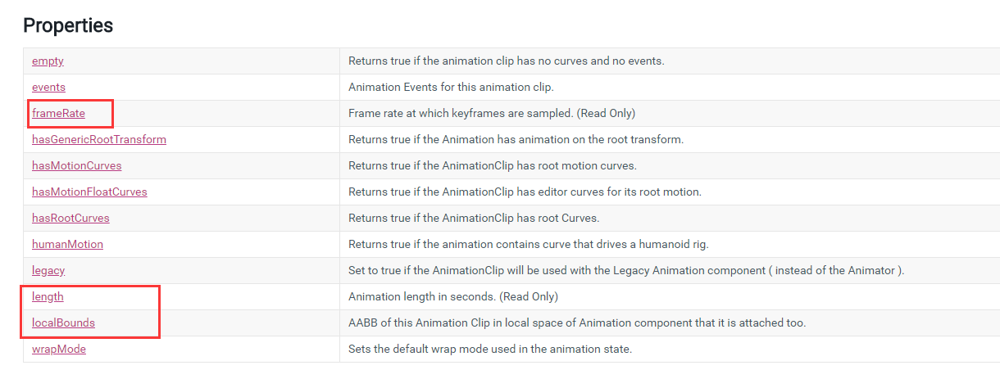

# Unity Learn

## RuntimeInitializeOnLoadMethod

 初始化回调方法 

没有场景 没有 游戏对象 的初始化 启动脚本

```c#
	[RuntimeInitializeOnLoadMethod]
    static void GameStart()
    {
        GameObject go = Resources.Load<GameObject>("");
        GameObject.Instantiate(go);
    }
```

## AnimationClip



AnimationClip.frameRate

AnimationClip.SampleAnimation

### 获取Animator下所有的AnimationClip

```c#
AnimationClip[] clip = transform.GetComponent<Animator>().runtimeAnimatorController.animationClips;
Debug.Log(clip.Length);
Debug.Log(clip[0].name);
```

## 性能优化相关

[Profiler中WaitForTargetFPS详解](https://blog.csdn.net/suifcd/article/details/50942686)

[Unity性能优化总结](https://www.jianshu.com/p/d6da201810a7)

[Unity Profiler 性能分析](https://www.cnblogs.com/zhaoqingqing/p/5059479.html)

[GPU分析工具RenderDoc使用](https://zhuanlan.zhihu.com/p/80704313)

## Editor相关

```c#
// 菜单栏
// itemName：菜单名称路径 
// isValidateFunction：不写为false，true则点击菜单前就会调用 
// priority：菜单项显示排序 相邻的两个priority参数值相差>=11，则认为是不同组的，中间会有线分割显示
[MenuItem(itemName = "Tool/Test", isValidateFunction = false, priority = 1)]
private static void ToolMain()
{
	Debug.Log("test");
}

// 快捷键调用
// _w W 
// #w shift+w 
// %w ctrl+w 
// &w Alt+w
[MenuItem("Tool/Test #w")]
private static void ToolMain()
{
	Debug.Log("test");
}

// 组件添加菜单栏
[MenuItem("GameObject/Meow", false,11)]
private static void Meow()
{
   Debug.Log("Meow");
}
[MenuItem("Assets/Test", false, 11)]
private static void Test()
{
    Debug.Log("1111");
}

// 获取当前选中的GameObject
GameObject[] a = Selection.gameObjects;

// 弹选择框
int choice = EditorUtility.DisplayDialogComplex("标题", "描述", "选项", "选项", "选项");
Debug.Log("选择的是：" + choice);

// 弹窗
EditorUtility.DisplayDialog("警告", "操作失误了", "确定");

// 选择文件
string path = EditorUtility.OpenFilePanel("选择文件", "", "");

// 获取选中资源路径
[MenuItem("Assets/喵：标记资源导出", false, 11)]
private static void SetAssetExporter()
{
    string[] a = Selection.assetGUIDs;
    for (int i = 0; i < a.Length; i++)
    {
        string assetPath = AssetDatabase.GUIDToAssetPath(a[i]);
        Debug.Log(assetPath);
    }        
}

// 编辑器update
[ExecuteInEditMode]
public class XXXX : MonoBehaviour
{
    private void OnEnable()
    {
#if UNITY_EDITOR
    	UnityEditor.EditorApplication.update += UpdatePerFrame;
#endif
    }
    private void OnDisable()
    {
#if UNITY_EDITOR
    	UnityEditor.EditorApplication.update -= UpdatePerFrame;
#endif
    }
    private void UpdatePerFrame()
    {
        
    }
}

// 编辑器窗口相机
SceneView.lastActiveSceneView.camera.transform;

// 自定义Component Inspector面板修改
[CustomEditor(typeof(XXX))]
public class XXXEditor : Editor
{
    private XXX test;
    // 用于以完全通用的方式编辑对象上的属性，可以自动处理撤销和为预置的UI设置样式
	private SerializedProperty spXX;
    
    private void OnEnable()
    {
        test = (XXX)base.target;
        spXX = serializedObject.FindProperty("XXX类里的属性变量名");
    }
    public override void OnInspectorGUI()
    {
        // 显示相应属性
        EditorGUILayout.PropertyField(spXX, new GUIContent("属性说明"));
        // 如果属性是数组
        if (spXX.isArray)
        {
            for (int i = 0; i < spXX.arraySize; i++)
            {
                SerializedProperty spXXp = spXX.GetArrayElementAtIndex(i);
                if (spXXp != null)
                {
                    SerializedProperty spXXpp = spXXp.FindPropertyRelative("XX");
                    if (spXXpp != null)
                    {
                        // TODO
                    }
                }
            }
        }
        // 滑动条
        tempdis = EditorGUILayout.Slider(tempdis, 0F, maxDis);
        // 浮点数
        tempdis = EditorGUILayout.FloatField(maxDis, GUILayout.Width(50));
        // 应用修改的属性 一定要加
        serializedObject.ApplyModifiedProperties();
    }
}
// 样式选择
GUILayout.Label("", EditorStyles.XXX);

```

**HelpURL()**
HelpURL（）提供一个自定义的文档链接，点击组件上的文档图标既能打开到你指定的链接，如下所示：

```
[HelpURL("http://www.baidu.com")]
public class People : MonoBehaviour {
    public string name;
    public int age;
}
```

[获取Unity生产的预览图](https://www.jianshu.com/p/02b80321bbae)

[GUILayout](https://www.cnblogs.com/pepe/p/3490347.html)

[Customize the Unity Editor with UIElements!](https://www.youtube.com/watch?v=CZ39btQ0XlE)

## 资源相关

[资源机制](https://www.jianshu.com/p/ca5cb9d910c0)

[unity资源相关](https://www.cnblogs.com/twjcnblog/p/5673309.html)

获取资源FileName

```
System.IO.Path.GetFileName(AssetDatabase.GUIDToAssetPath(GUID[i]));
System.IO.Path.GetFileNameWithoutExtension(AssetDatabase.GUIDToAssetPath(GUID[i]));
```

## DLL相关

- 更新Unity中的DLL时必须关闭Unity后导入新DLL

- 声明DLL内的C++函数

  ```C++
  public unsafe static class TestDLL
  {
      [DllImport("DLLName")] public static extern void XXX(XXXXX);
      [DllImport("DLLName")] public static extern void XXX(XXXXX);
  }
  ```

## 字符串相关

```c#
// string转ASCII码单字节数组
byte[] a = Encoding.Default.GetBytes(str);
```

[Encoding官方文档](https://docs.microsoft.com/zh-cn/dotnet/standard/base-types/character-encoding)

## NativeArray

  ```c++
// 开辟N个T类型的内存空间 Allocator.Temp 释放类型 临时数据用temp即可
// NativeArrayOptions.UninitializedMemory不会将内存中数据置零，效率略高
NativeArray<T> test = new NativeArray<T>(count,Allocator.Temp,NativeArrayOptions.UninitializedMemory);
  ```

## Matrix4x4

[官方API文档](https://docs.unity3d.com/ScriptReference/Matrix4x4.html)

- transpose()  返回这个矩阵的转置矩阵(只读)
- Matrix4x4.inverse 这个矩阵的逆矩阵
- transform的right,up,forward,position尾+1竖放，则为transform的世界空间矩阵

## Mathematics

[官方API文档](https://docs.unity3d.com/Packages/com.unity.mathematics@1.1/api/Unity.Mathematics.html)

Unity.Mathematics.math.mul() 返回矩阵相乘结果

```c++
Matrix4x4 pos = transform.localToWorldMatrix;
float4 pos2 = mul(pos, new float4(-0.5f, 0.5f, 0.5f, 1));
Debug.Log(mul(pos.inverse, pos2));
Debug.Log(mul(pos2, ((Matrix4x4)transpose(pos)).inverse));
```

## Transform

transform.worldToLocalMatrix     将一个点从世界空间转换为局部空间的矩阵(只读)。

transform.localToWorldMatrix      将点从局部空间转换到世界空间的矩阵(只读)。

transform.forward 在世界坐标系中表示物体正前方
transform.right 在世界坐标系中表示物体正右方
transform.up 在世界坐标系中表示物体正上方

## UnsafeUtility

[UnsafeUtility官方API文档](https://docs.unity3d.com/ScriptReference/Unity.Collections.LowLevel.Unsafe.UnsafeUtility.html)

- unsafe关键字表示不安全上下文，类型或成员的整个正文范围均被视为不安全上下文，在该范围内可使用指针
- fixed 语句禁止垃圾回收器重定位可移动的变量，只能出现在不安全的上下文中，但由于unity使用Boehm GC，不会移动object的内存位置，暂时可以不用管
- UnsafeUtility.MemCpy()	C#中的内存拷贝API

## RequireComponent

RequireComponent属性自动将所需的组件添加为依赖项，避免设置错误

```c#
[RequireComponent(typeof(TextureExporter))]
[RequireComponent(typeof(MaterialExporter))]
[RequireComponent(typeof(MeshExporter))]
public unsafe class SceneExporter : MonoBehaviour
{

}
```


## MipMap

在三维计算机图形的贴图渲染中最常用的技术，为加快渲染进度和减少图像锯齿，贴图被处理成由一系列被预先计算和优化过的图片组成的文件

unity会根据相机距离由近到远生成 8 张像素逐渐降低的贴图

优点：

减少显存带宽，降低渲染压力，随着相机的推远贴图会随之切换成低像素的体贴，从而节省资源开支

缺点：

增加游戏包体的大小和占用一定量的内存，过的Mipmap使用会对内存造成很大压力，建议只对大物件设置Mipmap

## CubeMap立方体贴图

CubeMap包含6个2D正方形纹理，每个2D纹理都是立方体的一个面，Up,Down,Forward,Back,Left,Right

通常用来作为具有反射属性物体的反射源,可以使用方向向量进行索引采样

待学习[CubeMap](https://blog.csdn.net/v_xchen_v/article/details/79474193)

## LOD

> LOD(Level of detail)多层次细节，是最常用的游戏优化技术
>
> 按照模型的位置和重要程度决定物体渲染的资源分配，降低非重要物体的面数和细节度，从而获得高效率的渲染运算

https://mp.weixin.qq.com/s/qWjvI1xkS31sGLhBi1JzbA

## 动态合批

如果动态物体共用着相同的材质，那么Unity会自动对这些物体进行批处理。动态批处理操作是自动完成的，并不需要你进行额外的操作。
动态批处理：一切都是自动的，不需要做任何操作，而且物体是可以移动的，但是限制很多。

静态批处理：自由度很高，限制很少，缺点可能会占用更多的内存，而且经过静态批处理后的所有物体都不可以再移动了。

## Mesh

PrimitiveType.Cube 

## Shader相关

### Fixed Function Shader - 固定函数着色器

### Vertex Shader - 顶点着色器

### Fragment Shader - 片元着色器

### Surface Shader - 表面着色器

### Compute Shader - 计算着色器

- DX11新特性，独立于其他shader，不在传统的渲染管线流程内，不需要操作网格mesh和贴图texture数据，在OpenGL或DirectX存储空间中工作，相对独立的处理过程。并且能输出数据的缓冲或贴图，跨线程的执行分享存储。

- 把一些大计算量又不是特别复杂的运算直接交给GPU运算，即Compute Shader是在GPU上运行的程序。

- 游戏中可以使用Compute Shader实现光线追踪，A-Buffer采样抗锯齿，物理特性，AI运算，图像处理，PostProcessing等等。

- Unity Compute Shader必须由C#驱动
  1. C#创建渲染所需的信息包括模型、贴图、参数等然后调用Compute Shader
  2. Compute Shader计算出新的模型位置 对贴图进行处理 改变参数等
  3. Vertex Fragment Shader获得Compute Shader产生的信息进行渲染
  
- 优点

  涉及到大量的数学计算，并且是可以并行的没有很多分支的计算，都可以采用ComputeShader

- 缺点

  需要把数据从CPU传到GPU，然后GPU运算完之后，又从GPU传到CPU，这样的话可能会有点延迟，而且他们之间的传输速率也是一个瓶颈，但如果真的有大量的计算需求的话，还是不要犹豫地使用ComputeShader，它能带来的性能提升绝对是值得的

### Geometry Shader - 几何着色器

### Tessellation Shader - 细分曲面着色器

